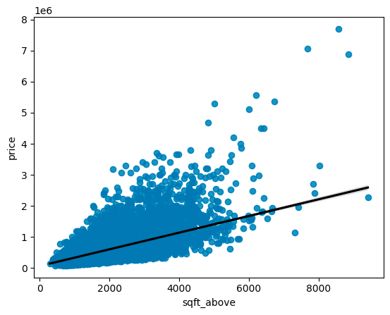
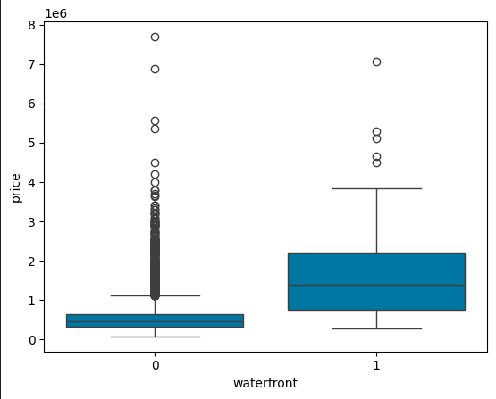

# Housing Prices Prediction and Analysis

## Introduction

This project focuses on analyzing and predicting housing prices based on various factors such as like floors, waterfront presence, latitude, bedrooms, basement area, view, bathrooms, living area, and grade etc. The goal is to apply multiple regression models to predict house prices and evaluate their performance.

## Technologies Used
- **Programming Language**: Python
- **Libraries**: Pandas, NumPy, Scikit-Learn, Matplotlib, Seaborn
- **Tools**: Jupyter Notebook

## Dataset

The dataset contains house sale prices for King County, which includes Seattle. It includes homes sold between May 2014 and May 2015.


| Variable      | Description                                                                                                 |
| ------------- | ----------------------------------------------------------------------------------------------------------- |
| id            | A notation for a house                                                                                      |
| date          | Date house was sold                                                                                         |
| price         | Price is prediction target                                                                                  |
| bedrooms      | Number of bedrooms                                                                                          |
| bathrooms     | Number of bathrooms                                                                                         |
| sqft_living   | Square footage of the home                                                                                  |
| sqft_lot      | Square footage of the lot                                                                                   |
| floors        | Total floors (levels) in house                                                                              |
| waterfront    | House which has a view to a waterfront                                                                      |
| view          | Has been viewed                                                                                             |
| condition     | How good the condition is overall                                                                           |
| grade         | overall grade given to the housing unit, based on King County grading system                                |
| sqft_above    | Square footage of house apart from basement                                                                 |
| sqft_basement | Square footage of the basement                                                                              |
| yr_built      | Built Year                                                                                                  |
| yr_renovated  | Year when house was renovated                                                                               |
| zipcode       | Zip code                                                                                                    |
| lat           | Latitude coordinate                                                                                         |
| long          | Longitude coordinate                                                                                        |
| sqft_living15 | Living room area in 2015(implies-- some renovations) This might or might not have affected the lotsize area |
| sqft_lot15    | LotSize area in 2015(implies-- some renovations)                                                            |

## Data Analysis and Visualization

Data visualization techniques such as box plots and distribution plots were used to understand the relationships between variables and housing prices.

<div align="center">
  
  The regression plot for `price` with respect to `waterfront`.
  
  
 The box plot for `price` with respect to `sqft_above`.
  
</div>


## Models and Evaluation

### Linear Regression

Linear Regression was applied to predict Housing prices. The R^2 score obtained for this model was: `0.6576379123728886`.

### Ridge Regression

Ridge Regression, a regularized version of Linear Regression, was also applied. The R^2 score obtained for this model was: `0.6478759163939111`.

### Polynomial Regression

Polynomial Regression was explored to capture non-linear relationships. The R^2 score obtained for this model was: `0.7002744271804466`.

## Conclusion

The analysis provided insights into the factors affecting housing prices and demonstrated the effectiveness of different regression models in predicting these prices. Future work could include exploring additional features and advanced modeling techniques.

## Acknowledgements

This project was developed as part of a machine learning study to apply regression techniques to real-world datasets.

## Getting Started
To get started with this project, clone the repository and install the necessary dependencies:
```bash
git clone https://github.com/burhanahmed1/Housing-Price-Prediction-and-Analysis.git
cd Housing-Price-Prediction-and-Analysis
pip install -r requirements.txt
```

## Usage
Open the Jupyter notebook:
```bash
jupyter notebook Housing-Price-Prediction-and-Analysis.ipynb
```

## Contributing
Contributions are welcome! Please fork this repository and submit pull requests.

## License
This project is licensed under the MIT License.
